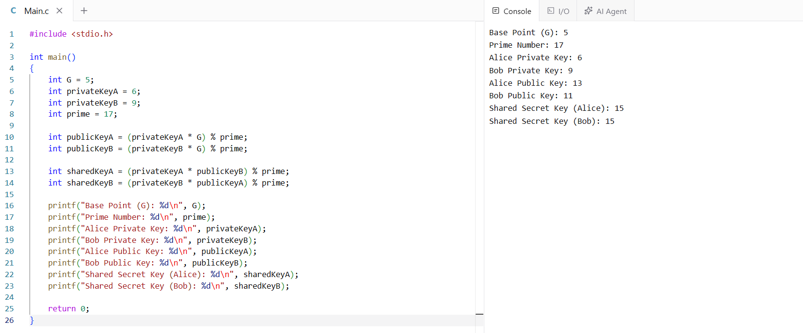

# EX-NO-11-ELLIPTIC-CURVE-CRYPTOGRAPHY-ECC

## Aim:
To Implement ELLIPTIC CURVE CRYPTOGRAPHY(ECC)

## ALGORITHM:

1. Elliptic Curve Cryptography (ECC) is a public-key cryptography technique based on the algebraic structure of elliptic curves over finite fields.

2. Initialization:
   - Select an elliptic curve equation \( y^2 = x^3 + ax + b \) with parameters \( a \) and \( b \), along with a large prime \( p \) (defining the finite field).
   - Choose a base point \( G \) on the curve, which will be used for generating public keys.

3. Key Generation:
   - Each party selects a private key \( d \) (a random integer).
   - Calculate the public key as \( Q = d \times G \) (using elliptic curve point multiplication).

4. Encryption and Decryption:
   - Encryption: The sender uses the recipient’s public key and the base point \( G \) to encode the message.
   - Decryption: The recipient uses their private key to decode the message and retrieve the original plaintext.

5. Security: ECC’s security relies on the Elliptic Curve Discrete Logarithm Problem (ECDLP), making it highly secure with shorter key lengths compared to traditional methods like RSA.

## Program:

~~~
#include <stdio.h>

int main()
{
    int G = 5;
    int privateKeyA = 6;
    int privateKeyB = 9;
    int prime = 17;

    int publicKeyA = (privateKeyA * G) % prime;
    int publicKeyB = (privateKeyB * G) % prime;

    int sharedKeyA = (privateKeyA * publicKeyB) % prime;
    int sharedKeyB = (privateKeyB * publicKeyA) % prime;

    printf("Base Point (G): %d\n", G);
    printf("Prime Number: %d\n", prime);
    printf("Alice Private Key: %d\n", privateKeyA);
    printf("Bob Private Key: %d\n", privateKeyB);
    printf("Alice Public Key: %d\n", publicKeyA);
    printf("Bob Public Key: %d\n", publicKeyB);
    printf("Shared Secret Key (Alice): %d\n", sharedKeyA);
    printf("Shared Secret Key (Bob): %d\n", sharedKeyB);

    return 0;
}
~~~

## Output:

## Result:
The program is executed successfully

